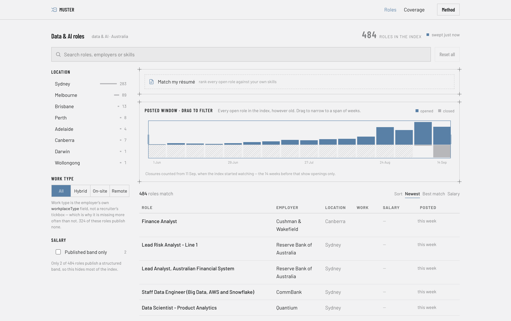

<h1 align="center">
  
</h1>

<p align="center">
  <strong>Open data, analytics and ML roles in Australia — read from the employers'
  own hiring systems, not from job boards.</strong>
</p>

<p align="center">
  <a href="https://muster.sidharthjoly.com/"><strong>muster.sidharthjoly.com</strong></a>
  &nbsp;·&nbsp;
  <a href="docs/api.md">Data API</a>
  &nbsp;·&nbsp;
  <a href="docs/mcp.md">MCP</a>
  &nbsp;·&nbsp;
  <a href="docs/build-log.md">Build log</a>
</p>

<p align="center">
  <a href="LICENSE"></a>
  
  <a href="https://muster.sidharthjoly.com/data/v1/manifest.json"></a>
  <a href="docs/mcp.md"></a>
</p>

---

Muster looks at the **applicant tracking system** that employers use to hire people. These systems include Greenhouse, Workday, Lever, Ashby, SmartRecruiters, Oracle, and Eightfold. 

Muster shares what it finds as:
* A searchable index
* An open JSON API
* An MCP endpoint

It is free to use. You do not need an account or to install anything.

Each row represents one job opening an employer currently has. Each row shows the job's ID from that ATS and a link to the employer's application form. When a job is removed from the board, it is also removed from this list.

<p align="center">
  <a href="https://muster.sidharthjoly.com/">
    
  </a>
</p>

<p align="center">
  <sub>The chart across the top <strong>is</strong> the date filter — drag a span of weeks to
  narrow the list. Hatched weeks are the ones that ended before the index started watching
  for closures, drawn as unmeasured rather than as a confident zero.</sub>
</p>

## Why not a job board

Job boards are filled by recruiters and companies that collect job listings. This causes several issues:

*   The same job may appear many times with slightly different titles.
*   Some listings are from agencies advertising jobs they do not own.
*   Jobs that were filled in June might still be online in September because no one removed them.

Reading the ATS directly changes three things you can feel while using it:

| | |
|---|---|
| **No duplicates** | Each job has a unique ID from the employer's system. If you see two jobs with the same title on one board, they are two different jobs. They are not the same job posted twice. |
| **Apply links go to the employer** | Every link takes you directly to the company's application form. There are no redirects. No one else sells your information. |
| **Filled roles disappear** | Every scan checks the employer's entire board. It compares the current list to the last one. If a job is gone, it is marked as closed and removed from the list. |

## At a glance

<!-- STATS:BEGIN -->
| | |
|---|---|
| Open roles in Australia | **9,146** |
| — of them data / analytics / ML | **485** |
| Employer boards watched | **911** |
| Requisitions seen in total | **330,014** |
| ATS systems supported | **7** |
| Refreshed | **4× a day** |

<sub>Figures from the build of 18 September 2026. Live counts are in
[`manifest.json`](https://muster.sidharthjoly.com/data/v1/manifest.json);
`scripts/update_readme_stats.py` refreshes this block.</sub>
<!-- STATS:END -->

At that time, the biggest employers of data workers were:
* Bjak (63 open data roles)
* Commonwealth Bank (20)
* Canva (16)
* Westpac (16)
* Quantium (12)
* Xero (11)

There were also several hundred smaller jobs. Most of these were in Sydney (279) and Melbourne (93). Brisbane, Perth, and Canberra had some jobs, but much fewer.

## Using the site

**Search** through job titles, companies, and the full job description. This way, searching for `dbt`, `causal inference`, or `Snowflake` will find roles that mention these terms anywhere, not just in the title.

**The dial** is the chart at the top. Dragging across it filters the dates. It shows when roles open and close each week. Selecting a range shows only the roles posted in those weeks.

**Résumé matching.** Upload a PDF or paste your text. We rank every open job based on your skills. Each row shows the specific words that matched. This helps you see why a job is ranked highly. The list is **ranked, not filtered**. We show every job, even if it has a low score. If a job has no matches, the list will say so on that row.

**Your résumé stays in your browser.** The page reads the file on your computer and ranks it in the tab. The site uses static files on a CDN. There is nothing to upload. This is how the site is built. It is not a promise about what a server does with your data.

The only exception is the `match_resume` tool in the MCP endpoint. This is a server. It must receive the text it ranks. It keeps the text in memory for that call only. It does not store or log the data. However, this is a promise. The paragraph above is stronger because it does not need a promise. Use the site if you prefer not to take it.

## Data API and MCP

The index is published as JSON on the same host. There is no key and no rate limit. Static files are served with `access-control-allow-origin: *`.

```bash
# the data/analytics slice — a few hundred roles, ~170KB gzipped
curl -s --compressed https://muster.sidharthjoly.com/data/v1/jobs-data.json

# counts, freshness and the matching vocabularies, ~3KB — small enough to poll
curl -s --compressed https://muster.sidharthjoly.com/data/v1/manifest.json
```

There is also an **MCP server** for agents. It filters and ranks data on the server side instead of sending the whole file.

```bash
claude mcp add --transport http muster https://muster.sidharthjoly.com/mcp
```

Or one click — the endpoint is a URL without a key, so there is nothing to fill in the config first:

<p>
  <a href="https://vscode.dev/redirect/mcp/install?name=muster&config=%7B%22type%22%3A%22http%22%2C%22url%22%3A%22https%3A%2F%2Fmuster.sidharthjoly.com%2Fmcp%22%7D"></a>
  <a href="https://cursor.com/en/install-mcp?name=muster&config=eyJ1cmwiOiJodHRwczovL211c3Rlci5zaWRoYXJ0aGpvbHkuY29tL21jcCJ9"></a>
</p>

It provides `search_roles`, `get_role`, `index_health`, and `match_resume`.

Both interfaces use a snapshot that is rebuilt four times a day. Every response shows the build time.

You can find the row schema, versioning rules, and how to get data slices in **[docs/api.md](docs/api.md)**. The tool-by-tool guide is in **[docs/mcp.md](docs/mcp.md)**.

## How it works

There are seven adapters. Each adapter works with one ATS. They turn a vendor's JSON feed into a single `Job` record.

A sweep finds every board that is due. It compares the results to what is currently stored. It then updates what was opened and what was closed.

Everything is saved in Postgres. The public site is a static export of the Australian open slice. This is pushed to `gh-pages`.

The MCP endpoint is a Cloudflare Worker. It reads that same export. This ensures the endpoint always matches the site.

Four things carry most of the weight:

**Closure detection is the main feature of this project.** Every sweep looks at the employer's entire board. If a requisition is missing, it can be marked as closed. 

To keep things safe, the system only allows a complete board to close jobs. If a fetch fails or is incomplete, the system cannot tell the difference between a real missing job and a technical error. In those cases, the board is imported but is not allowed to close anything. You can recover old rows, but you cannot fix a broken history.

**Boards are found, not typed in.** There is no list that links companies to ATS tokens. Instead, a crawler constantly searches for them. It looks at the Common Crawl URL index for ATS domains. Then, it looks at specific careers pages for boards that a URL index cannot see. This includes things like Lever, iframe embeds, and the two-part identities used by Workday, Oracle, and Eightfold. The unit of discovery is a **board, never a job**: one token, found once, gives access to that employer's entire history of job postings forever.

**Boards are updated on their own schedule.** Most of the boards we watch have never posted an Australian data role. Updating all of them at the same time made "refresh more often" too expensive. Because of this, each board has its own target update time based on its tier. The scheduler ranks boards by how *late* they are based on their own schedule, not just by how old they are.

**Politeness is built into the system, not just a setting.**

The crawler follows these rules:
* It respects `Crawl-delay` in `robots.txt` files.
* It processes requests to one host one at a time with a minimum delay.
* The User-Agent identifies the project.
* It filters responses by content type and limits the number of bytes.
* There is a lifetime limit on the number of pages per host. No host can get more than a few pages total.
* It does not use proxies or try to hide its identity. If those rules are broken, the employer stays out of the index.

The full engineering record is in **[docs/build-log.md](docs/build-log.md)**. This includes:
* The ATS audit that set the build order.
* Why Workday was not the first adapter.
* The 40% sweep shortfall that was hidden by four successful-looking runs a day.
* The decisions that were changed.

## Limitations

### By design

**No "chance of being hired" score.** It would be easy to put a number next to a ranked job, but that number would be made up. Muster has never seen any applications, interviews, or hires. It only sees when job postings appear and disappear. Instead, it shows what it actually sees: how long a job has been open and how many similar jobs the same employer has open.

**No salary filter.** Less than 1% of open jobs in Australia show a salary range. If you filter by salary, you will miss almost all jobs. Salary info is only shown for the jobs that include it.

**No broad coverage.** If an employer does not use one of the seven supported systems, they are not listed here. This is the trade-off for the information provided above. Agencies can run their own ATS boards, but none are currently in the Australian section. Every row comes from the board of the company you would actually work for.

### Current gaps

- **Some employers show as raw system names**, like `Dxctechnology.wd1/dxc` instead of "DXC". Not every board provides a clean name. It is better to show the system name than to guess the wrong name.
- **The closure history is new.** Muster only knows a role closed if it saw it happen. It started watching on 11 September 2026. Older weeks only show open roles. The chart marks these as "unwatched" instead of showing zero. This gets better over time and cannot be added to old data.
- **Locations are from the employer's own field.** We show them as they are. One company posting many jobs in one city can take over a section. For example, Bjak has about one-eighth of all open data roles, all in Sydney. This is three times more than Commonwealth Bank.
- **About 5% of roles have no description.** You can search for these by title and employer. However, there is no text to match against a résumé. The page says so.
- **The website is a snapshot.** It is rebuilt four times a day. Both pages show the build time. The `/runs` page counts "N hours ago" based on the export time, not the current time.

Is the index incorrect or missing an employer you expect to see?
[Open an issue](https://github.com/sidharthjoly/Muster/issues).

## Running it yourself

Requires Python 3.14 and [uv](https://docs.astral.sh/uv/).

```bash
git clone https://github.com/sidharthjoly/Muster
cd Muster
uv sync

# Pull a few boards into a local SQLite index
uv run python -m muster.run --vendor greenhouse --max-boards 5

# Browse what you collected
uv run python -m muster.web        # http://127.0.0.1:8765
```

Two things to know about the local UI:

- **It only works with SQLite.** The data input uses Postgres, but the search layer uses FTS5. `muster.web` will not start if `DATABASE_URL` is set. This prevents it from searching the wrong data. Remove the setting to browse a local index.
- **Resume matching is missing.** This feature needs the entire collection in one search. Only the static export provides this. To see it on your computer, build the static site instead:

```bash
uv run python scripts/export_static.py --serve    # http://127.0.0.1:8766
```

The MCP server uses TypeScript and runs independently:

```bash
npm install
npx wrangler dev                   # http://127.0.0.1:8787/mcp
```

Tests: `uv run pytest` — 320 tests total. No internet connection is needed.

## License

[Apache 2.0](LICENSE)
